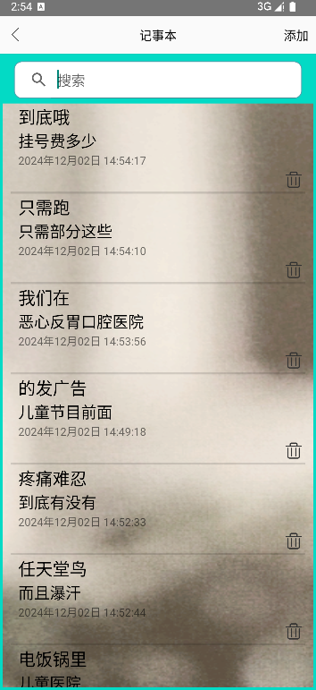
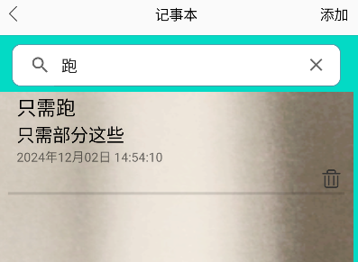
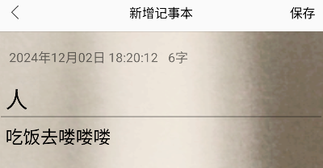
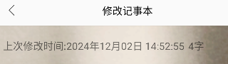
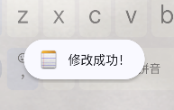
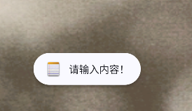
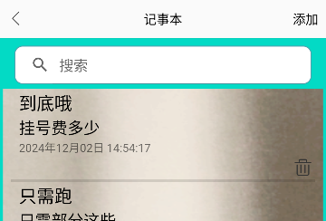
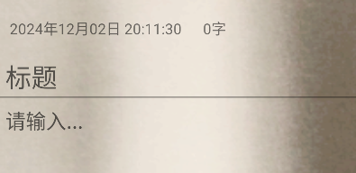
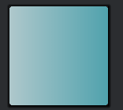
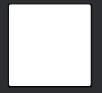

# 安卓记事本应用 期中实验

  本次项目实现了记事本的一些基本功能，如保存笔记，记录保存时间戳，显示笔记字数，按笔记标题搜索，更换背景图，弹窗提醒保存·修改·删除等是否成功等功能。界面简洁明亮，操作简单。

  以下将对这些功能进行效果展示和关键代码的展示。

### 1.主页面笔记显示标题和部分正文，下方显示时间戳功能

效果展示:

代码节选:
//显示标题
     
    <LinearLayout xmlns:android="http://schemas.android.com/apk/res/android"
    xmlns:app="http://schemas.android.com/apk/res-auto"
    Android:id="@+id/con"
    Android：方向=“垂直”
    Android:layout_width="match_parent"
    Android:layout_height="wrap_content">

    <文本视图
    Android:id="@+id/title"
    Android:layout_width="wrap_content"
    Android:layout_height="wrap_content"
    Android:textColor="@color/black"
    Android:textSize="22sp"
    Android:maxlines="1"
    Android:layout_marginStart="10dp"/>
    <文本视图
    Android:id="@+id/content"
    Android:layout_width="wrap_content"
    Android:layout_height="wrap_content"
    Android:textColor="@color/black"
    Android:textSize="20sp"
    Android:maxlines="2"
    Android:layout_marginStart="10dp"/>
    <文本视图
    Android:id="@+id/create_time"
    Android:layout_width="wrap_content"
    Android:layout_height="wrap_content"
    Android:layout_marginStart="10dp"/>

    <ImageView
    Android:id="@+id/del"
    Android:layout_width="30dp"
    Android:layout_height="30dp"
    Android:src="@drawable/del"
    Android:layout_gravity="end"/>
    </LinearLayout>

    //显示时间

    else {
        Date date = new Date(System.currentTimeMillis());
        SimpleDateFormat simpleDateFormat = new SimpleDateFormat("yyyy年MM月dd日 HH:mm:ss", Locale.CHINA);//格式化日期和时间
        time.setText(simpleDateFormat.format(date));
        titleBar.setTitle("新增记事本");//设置标题
    }

    定义了一个 LinearLayout 布局，设置用于显示标题时间戳等的文本框和右下角的图片图标。
    笔记列表中每条笔记显示其最后修改时的标题时间戳等。在数据库中为笔记添加标题时间戳等字段，修改笔记会动态更新。

### 2.依照标题搜索功能

效果展示：

代码节选:

        //搜索笔记
        searchView.setOnQueryTextListener(new SearchView.OnQueryTextListener() {
            @Override
            public boolean onQueryTextSubmit(String query) {
                if (!TextUtils.isEmpty(query)){
                    noteList.clear();
                    noteList.addAll(notePadProvider.getNotes(query));
                    noteAdapter.notifyDataSetChanged();
                    searchView.clearFocus();
                }
                return false;
            }

            @Override
            public boolean onQueryTextChange(String newText) {
                if (TextUtils.isEmpty(newText)){
                    noteList.clear();
                    noteList.addAll(notePadProvider.getNotes(null));
                    noteAdapter.notifyDataSetChanged();
                    searchView.clearFocus();
                }
                return false;
            }
        });

      当用户提交搜索文本时（例如按下回车键），会执行 onQueryTextSubmit 方法。如果查询文本不为空，它会清空当前的 noteList，然后使用 notePadProvider 的 getNotes 方法获取与查询文本匹配的笔记列表，并更新 noteList。接着调用 noteAdapter 的 notifyDataSetChanged 方法来通知列表数据集已改变，需要刷新视图。最后，清除 SearchView 的焦点。

### 3.新增笔记时显示当前时间和显示正文字数功能,修改笔记时显示上次修改时间和显示正文字数功能

效果展示：

代码节选:

    protected void onCreate(Bundle savedInstanceState) {
    super.onCreate(savedInstanceState);
    setContentView(R.layout.activity_add_note);//设置当前视图
    title=findViewById(R.id.title);
    content=findViewById(R.id.content);
    number=findViewById(R.id.number);
    time=findViewById(R.id.time);
    flag = getIntent().getStringExtra("flag");
    titleBar.getRightTextView().setText("保存");

        if (flag!=null){
            note = (Notes) getIntent().getSerializableExtra("entity");
            title.setText(note.getTitle());
            content.setText(note.getContent());
            time.setText("上次修改时间:"+ note.getTime());
            number.setText(note.getContent().length()+"字");
            titleBar.setTitle("修改记事本");
        }
        //设置时间格式
        else {
            Date date = new Date(System.currentTimeMillis());
            SimpleDateFormat simpleDateFormat = new SimpleDateFormat("yyyy年MM月dd日 HH:mm:ss", Locale.CHINA);
            time.setText(simpleDateFormat.format(date));
            titleBar.setTitle("新增记事本");
        }

        //更新正文内容字数
        content.addTextChangedListener(new TextWatcher() {
            @Override
            public void beforeTextChanged(CharSequence charSequence, int i, int i1, int i2) {
            }//监听文本变化

            @Override
            public void onTextChanged(CharSequence charSequence, int i, int i1, int i2) {
                number.setText(content.getText().toString().length()+"字");
            }

            @Override
            public void afterTextChanged(Editable editable) {
            }
        });
    }

### 4.保存·修改·删除时于屏幕下方弹窗提醒功能

效果展示：

代码节选:
                            
                            在点击保存按钮后触发执行
                            //弹窗提醒    
                            Toast.makeText(NoteEditor0.this, "保存成功！", Toast.LENGTH_SHORT).show();
                        }
                        else {
                            Toast.makeText(NoteEditor0.this, "未知错误", Toast.LENGTH_SHORT).show();
                        }
                    }
                    else {
                        if (notePadProvider.updateNotes(String.valueOf(note.getId()),title.getText().toString(),content.getText().toString(),simpleDateFormat.format(date))){
                            Toast.makeText(NoteEditor0.this, "修改成功！", Toast.LENGTH_SHORT).show();
                        }//更新成功
                        else {
                            Toast.makeText(NoteEditor0.this, "未知错误", Toast.LENGTH_SHORT).show();
                        }//更新失败
                    }
                    finish();
                }
                else {
                    Toast.makeText(NoteEditor0.this, "请输入内容！", Toast.LENGTH_SHORT).show();
                }
            }
        });
                  
            在点击保存按钮后触发执行
            

### 5.UI美化 背景图 

效果展示：

代码节选:

     //一键删除
    <ImageView
        android:id="@+id/del"
        android:layout_width="30dp"
        android:layout_height="30dp"
        android:src="@drawable/del"
        android:layout_gravity="end" />

    <ListView
        android:layout_margin="6dp"
        android:background="@drawable/note_background04"
        android:id="@+id/listView"

        android:paddingStart="10dp"
        android:paddingEnd="10dp"

        android:dividerHeight="3dp"
        android:layout_marginTop="5dp"
        android:layout_width="match_parent"
        android:layout_height="match_parent"/>

        titleBar.setTitle("记事本");
        titleBar.getRightTextView().setText("添加");
        titleBar.setOnRightViewClickListener(new View.OnClickListener() {
            @Override
            public void onClick(View view) {
                startActivity(new Intent(NoteList.this, NoteEditor0.class));
            }
        });

         //笔记界面
         <androidx.ConstraintLayout.widget。ConstraintLayout      xmlns:android="http://schemas.android.com/apk/res/android"
         xmlns:app="http://schemas.android.com/apk/res-auto"
    xmlns:tools="http://schemas.android.com/tools"
         android:layout_width="match_parent"
         android:layout_height="match_parent"
             tools:context="com.example.android.notepad.NoteEditor0"
         android:background="@drawable/note_background04">//添加背景图

    <TextView
        android:id="@+id/time"
        android:layout_width="wrap_content"
        android:layout_height="wrap_content"
        android:layout_marginTop="20dp"
        android:text=""
        android:textSize="16sp"
        app:layout_constraintEnd_toEndOf="parent"
        app:layout_constraintHorizontal_bias="0.065"
        app:layout_constraintStart_toStartOf="parent"
        app:layout_constraintTop_toTopOf="parent" />

    <TextView
        android:id="@+id/number"
        android:layout_width="wrap_content"
        android:layout_height="wrap_content"
        android:layout_marginTop="20dp"
        android:text="   0字"
        android:textSize="16sp"
        app:layout_constraintEnd_toEndOf="parent"
        app:layout_constraintHorizontal_bias="0.068"
        app:layout_constraintStart_toEndOf="@+id/time"
        app:layout_constraintTop_toTopOf="parent" />

    <EditText
        android:id="@+id/title"
        android:layout_width="match_parent"
        android:layout_height="wrap_content"
        android:hint="标题"
        android:inputType="text"
        android:lines="1"
        android:maxLength="10"
        android:paddingLeft="10dp"
        android:textColor="@color/black"
        android:textSize="28sp"
        android:layout_marginTop="10dp"
        app:layout_constraintEnd_toEndOf="parent"
        app:layout_constraintHorizontal_bias="0.0"
        app:layout_constraintStart_toStartOf="parent"
        app:layout_constraintTop_toBottomOf="@+id/number"
        android:autofillHints="" />

    <EditText
        android:id="@+id/content"
        android:layout_width="match_parent"
        android:layout_height="0dp"
        android:hint="请输入..."
        android:background="@null"
        android:gravity="start"
        android:textSize="22sp"
        android:paddingStart="10dp"
        android:textColor="@color/black"
        app:layout_constraintBottom_toBottomOf="parent"
        app:layout_constraintEnd_toEndOf="parent"
        app:layout_constraintStart_toStartOf="parent"
        app:layout_constraintTop_toBottomOf="@+id/title"
        android:autofillHints="" />
    </androidx.constraintlayout.widget.ConstraintLayout>

### 6.系统图标美化

效果展示：

代码节选:

    <?xml version="1.0" encoding="utf-8"?>
    <selector xmlns:android="http://schemas.android.com/apk/res/android">
    <item android:state_pressed="true">
        <shape>
            <gradient android:startColor="#96AFB0"
                android:endColor="#377780"
                android:angle="90" />
            <corners android:radius="15dip" />
            <padding android:left="10dp" android:top="10dp"
                android:right="10dp" android:bottom="10dp" />
        </shape>
    </item>

    <item android:state_focused="true">
        <shape>
            <gradient android:startColor="#377780"
                android:endColor="#377780"
                android:angle="90" />
            <corners android:radius="2dp" />
            <padding android:left="10dp" android:top="10dp"
                android:right="10dp" android:bottom="10dp" />
        </shape>
    </item>

    <!--不带状态的放在最后-->
    <item>
        <shape>
            <gradient android:startColor="#50A2AD" android:endColor="#AFC8CC"
                android:angle="180" />
            <corners android:radius="15dip" />
            <padding android:left="10dp" android:top="10dp"
                android:right="10dp" android:bottom="10dp" />
        </shape>
    </item>
    </selector>

    <?xml version="1.0" encoding="utf-8"?>
    <shape xmlns:android="http://schemas.android.com/apk/res/android"
    android:shape="rectangle">
    <stroke
    android:width="1dp"
    android:color="#50A2AD" />
    <solid  android:color="#ffffff" />
    <corners android:radius="10dp"/>
    </shape>    

   
编辑者：YuuLinN（喻）

